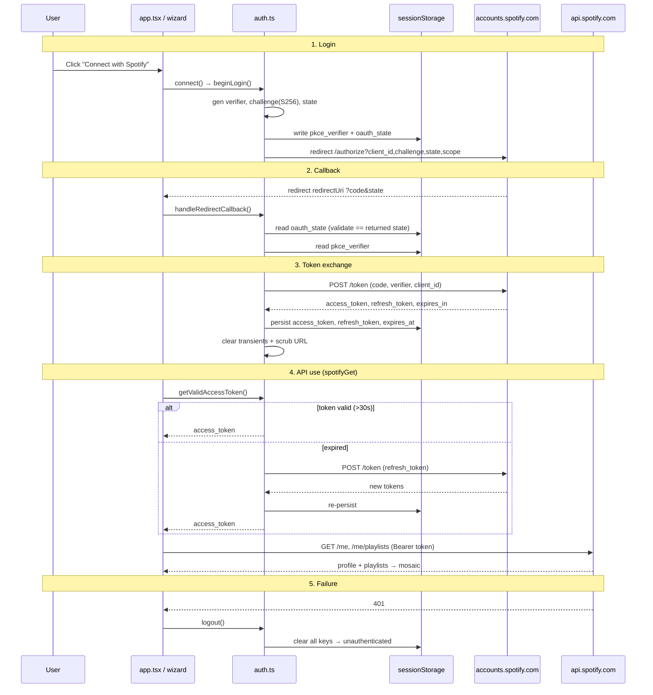

# Spotify Auth Data Flow

PKCE authorization-code flow. Tokens stored in `sessionStorage`. All code in the `mosaify` project.

## Diagram

## Key files

| File | Role |
|---|---|
| `auth.ts` | Login, callback, token exchange, refresh, persist, logout |
| `pkce.ts` | Code verifier, S256 challenge, state generation |
| `client.ts` | `spotifyGet` — Bearer header, 401 → logout |
| `config.ts` | `SPOTIFY_CONFIG` (clientId, redirectUri, scopes, URLs) |
| `endpoints.ts` | `/me`, `/me/playlists`, playlist artwork |
| `../../feature/src/lib/use-mosaify-wizard.ts` | Orchestration (connect, callback effect, fetches) |

## sessionStorage keys

- `spotify.pkce_verifier` — transient, cleared after exchange
- `spotify.oauth_state` — transient, CSRF check
- `spotify.access_token`
- `spotify.refresh_token`
- `spotify.expires_at`
