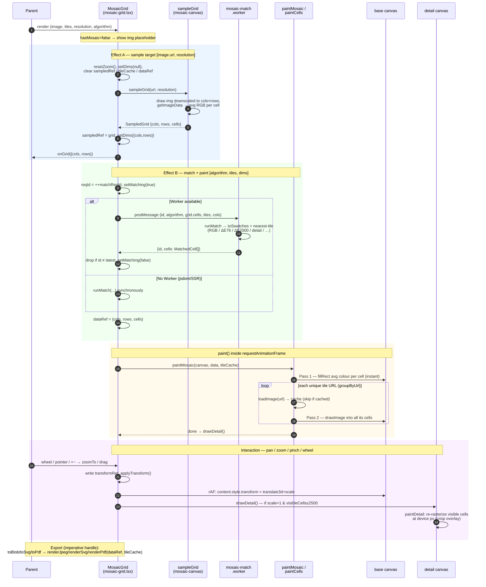
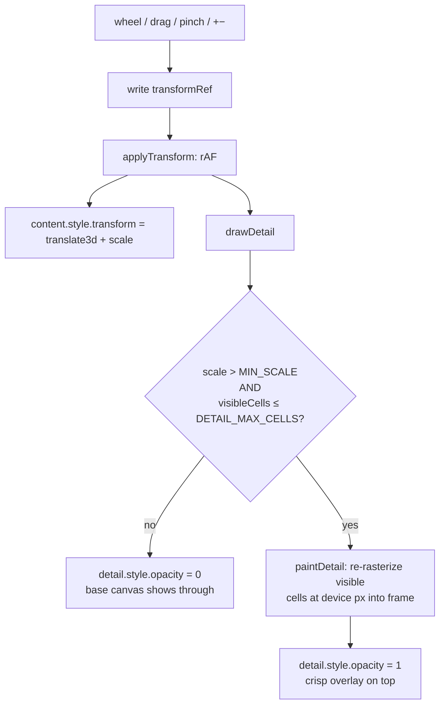

# @react-mono/mosaify-ui

This library was generated with [Nx](https://nx.dev).

## How `MosaicGrid` builds and renders a mosaic

`MosaicGrid` turns a target image + a set of tile images into a photomosaic painted
on a single `<canvas>`. The pipeline runs in four phases:

1. **Sample** (`sampleGrid`) — draws the target image downscaled to `cols×rows` and
   reads back one average RGB per cell. Grid dimensions derive from the image's aspect
   ratio, so the mosaic isn't stretched.
2. **Match** (`runMatch`, in a Web Worker) — maps each cell's colour to the nearest tile
   using the selected algorithm (RGB, ΔE76, ΔE2000, detail/Sobel, multi-scale, variety),
   returning `MatchedCell[]`. A monotonic request id drops stale responses from rapid
   toggles; falls back to a synchronous match where `Worker` is unavailable (jsdom/SSR).
3. **Paint** (`paintMosaic` / `paintCells`) — two-pass fill on one `<canvas>` (replacing
   ~40k `` nodes): instant average-colour blocks first, then each unique tile decoded
   once and stamped into all of its cells (progressive as tiles decode).
4. **Interact / overlay** — pan/zoom write the transform straight to the GPU-composited
   content layer (no React re-render); `paintDetail` re-rasterizes just the visible cells
   onto a crisp overlay canvas when zoomed in.

Export (`toBlob` / `toSvg` / `toPdf` on the imperative handle) re-renders the cached
mosaic data at high resolution rather than reading the GPU-capped on-screen canvas.

### The detail overlay (`detailRef`)

The base canvas (`canvasRef`) lives inside the transformed content layer, so pan/zoom
is free — but its fixed pixels blur when scaled up. `detailRef` is a sibling canvas
that is **not** transformed; `drawDetail` re-rasterizes only the visible slice into
frame pixels at device resolution, so zoomed-in tiles stay crisp. It runs every frame
from `applyTransform` (same frame as the transform write — no settle delay) and gates
itself to stay cheap: it only shows once zoomed past `MIN_SCALE` and while the visible
cell count (`cols·rows / scale²`) is under `DETAIL_MAX_CELLS` (2500); otherwise it hides
and the base shows through.

## Running unit tests

Run `nx test @react-mono/mosaify-ui` to execute the unit tests via [Vitest](https://vitest.dev/).
